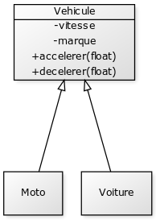

# Les principes de la programmation orienté objet.

## Table des matières

- [Présentation du concepte de programmation orienté objet (POO)](#poo)
- [Les classes et les objets](#co)
- [Attributs et méthodes](#am)
- [Principe d'encapsulation](#pe)
- [Héritage et composition](#hc)
- [Les classes abstraites](#ac)
- [Le polymorphisme](#po)

## Présentation du concepte de programmation orienté objet (POO) 

La programmation orienté objet est une méthode de programmation, un modèle s'articulant autour "d'objet" et de "données", contrairement à un language procédurale qui lui va s'orienté vers la logique et les actions.

Quand nous parlons d'objet, nous parlons intrasèquement lié à la donnée, la programmation orienté objet est une façon de manipuler la donnée dans un language.

## Les classes et les objets 

La classe peut être considérer comme une description d'un objet en programmation orienté objet. Les classes son le modèle de l'objet (la template, le plan).

Qu’est ce qu’un objet?

Pour comprendre ce qu'est un objet, prenons un exemple :

> Une voiture possède la plus pars du temps un couleur, un marque, et fait partie d'une série de modèle.
> Une voiture est aussi capable d'effectuer des actions, comme rouler ou frèner.
> Ces différents donnée vont définir les différentes particularités de l'objets.
> Cette voiture peu être la représentation d'un objet.

Pour conclure un objet est donc :

- Représenté par ses attributs
- Comportementalisé par ses différentes méthodes (action)
- Identifier par ses attributs

## Attributs et méthodes 

Les attributs représente l'état d'un objet, ils définissent les différentes particularités de l'objet.

Les methodes permettent de définir le comportement de l'objet, grâce à ces méthodes, nous pouvons aussi récupéré certains attribut selon leurs portées.

## Principe d'encapsulation 

L'encapsulation permet de définir des niveaux de visibilités des attributs de la classe.
Ce principe définie la portée d'un attribut ou encore d'une méthode l'exterieur de cette classe.

## Héritage et composition 

L'heritage et comme son nom l'indique une méthode pour faire hérité des particularités d'une classe vers une autre classe.
L'objet instacier sera donc l'enfant de la classe qu'il hérite.
 

 

Voici un exemple de schema d'héritage, nous pouvons observer que la classe Vehicule et la classe mère et Moto / Voiture sont les enfants.
 

Pourquoi utiliser l'heritage ?
 

Comme dans l'exemple ci dessus nous pouvons observer qu'une moto et une voiture sont tout deux un vehicule, ces vehicules peuvent tout deux accelerer ou encore decelerer.
Etant donnée que la moto et la voiture sont enfant de la classe Vehicule, ces dernier vont pouvoir hériter des différentes methodes de la classe mère.
On peut aussi remarquer que les vehicule auront les mêmes attribut, la vitesse et une marque, les enfants heriteront aussi de ces attributs.

 

Il est possible de limiter l'acces au différents attibuts ou methodes d'une classe mère grave au principe d'encapsulation.

## Les classes abstraites et concrètes 

Les classes abstraites sont similaire à des modèles, des templates de classes, se sont des classes objet qui ne stockeront aucune donnée et qui ne pourra être instacier.
Celle ci permettent de completer ce principe d'héritage et permet à chaque classes enfant de suivre ce modèle, tout en pouvant creer ses propres action / methodes en son seins.

Par exemple, si le vehicule est une classe abstraite, l'action d'accelerer est différente pour une moto et une voiture, nous pouvons donc redéfinir les methodes dans les classes de ces elemeents respective pour effectuer les actions différements.

Attention une classes abstraites n'est pas un objet, il n'est pas possible d'instancier une classe abstraite.

## Le polymorphisme

Le polymorphisme permet de réecrire les methodes existantes d'une classe mère dans son enfant, cela permet de redéfinir les actions specifiques à cette classe.
C'est une redéfinition des methodes.
